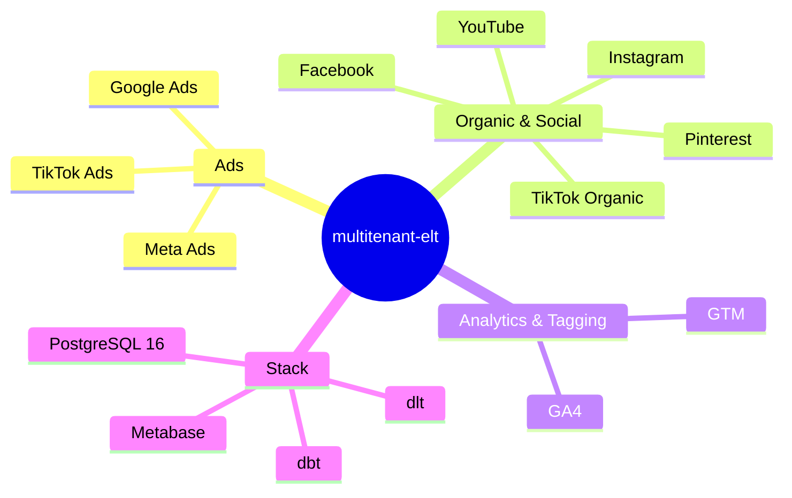

<div align="center">


# Multitenant ELT | Developmi

*Eliminate manual reporting across 10 marketing platforms - one pipeline, one dashboard, zero spreadsheets.*

[](pyproject.toml)
[](Dockerfile)
[](#)
[](LICENSE)
[](#)
[](#)

</div>

**Multi-tenant marketing data pipeline** - extract data from 10 ad and social platforms, transform it into clean metrics, and visualize it in Metabase. Built for digital agencies managing multiple clients.



---

## Table of contents

- [Features](#-features)
- [Connector status](#-connector-status)
- [Quick start](#-quick-start)
- [Architecture](#-architecture)
- [Docker deployment](#-docker-deployment)
- [Configuration](#-configuration)
- [Tests](#-tests)
- [Security](#-security)
- [Changelog](#-changelog)
- [Contributing](#-contributing)
- [License](#-license)
- [Contact & support](#-contact--support)

---

## Features

- **10 data connectors**: Meta Ads, TikTok Ads, Google Ads, Facebook Pages, Instagram Business, TikTok Organic, YouTube Data, Pinterest, GA4, GTM
- **Honest status tracking**: See [Connector status](#-connector-status) for which integrations are tested live vs. code-complete only
- **Multi-tenant by design**: per-client raw namespaces and dbt output schemas (`raw_<connector>_<client_id>` / `client_<client_id>`), YAML client config, shared observability
- **No-code connector config**: Add/remove platforms per client via YAML, no code changes
- **Pipeline orchestration**: Health checks, per-client loops, Telegram alerts
- **dbt transformations**: 30 staging models → intermediate → marts (35 models total)
- **Quality gate**: 228 tests, ruff linting, mypy type checking
- **Docker native**: Isolated services, two Docker networks, no vendor lock-in

---

## Connector status

*Transparency over hype. All 10 connectors are implemented with unit tests and dbt staging models. 3 have been tested against live APIs - the remaining 7 have code complete but need live API validation before production use.*

| Connector | Type | Tested live | Production ready | Notes |
|-----------|------|:-----------:|:----------------:|-------|
| Meta Ads | Ads | ✅ Yes | ✅ Yes | v25.0, 250+ rows verified |
| Facebook Page | Organic | ✅ Yes | ✅ Yes | v25.0, requires Page Access Token (not User Token) |
| Instagram Business | Organic | ✅ Yes | ✅ Yes | v25.0, some metrics require `metric_type=total_value` |
| TikTok Ads | Ads | ❌ No | ⚠️ Code + tests | API v1.3, needs live test |
| Google Ads | Ads | ❌ No | ⚠️ Code + tests | API v25, needs OAuth setup + live test |
| TikTok Organic | Organic | ❌ No | ⚠️ Code + tests | API may have migrated to developers.tiktok.com |
| YouTube | Organic | ❌ No | ⚠️ Code + tests | API v3, quota 10k units/day |
| Pinterest | Organic | ❌ No | ⚠️ Code + tests | API v5 |
| GA4 | Analytics | ❌ No | ⚠️ Code + tests | Service account auth required |
| GTM | Analytics | ❌ No | ⚠️ Code + tests | API v2 |

### Instagram diagnostics probe (read-only)

`agency_analytics/ig_probe.py` is a **read-only** diagnostic CLI for the
Instagram Business connector (never part of the scheduled pipeline). It answers
which account-insights metrics respond today and with which `metric_type`, the
real retention horizon per trailing window, which breakdown axes work per
metric, and eligibility below 100 followers — the data that drives the
`insights_daily` / `insights_totals` split and backfill decisions.

```bash
docker exec -w /app/src agency_pipeline \
  python -m agency_analytics.ig_probe --client example --read-only

# Local run, write the JSON report to a file, skip breakdown calls:
uv run python -m agency_analytics.ig_probe --client example --read-only \
  --skip-breakdowns --output /tmp/ig_probe_report.json
```

It makes no destructive calls and writes to no table (spec IG4). Full CLI
reference, report schema and call budget live in the module docstring
(`src/agency_analytics/ig_probe.py`). `scripts/pipeline.sh` is intentionally
unchanged: the probe is a manual diagnostics entry point, not a pipeline step.

---

## Quick Start

### Prerequisites

- [Docker](https://docs.docker.com/engine/install/) + [Docker Compose](https://docs.docker.com/compose/install/)
- [uv](https://docs.astral.sh/uv/getting-started/installation/) (Python package manager - recommended) or Python 3.12

### 1. Clone and configure

```bash
git clone https://github.com/Developmi/multitenant-elt.git
cd multitenant-elt
cp .env.example .env
# Edit .env with your API tokens, database passwords, and Telegram credentials
```

### 2. Start infrastructure

```bash
make setup-networks   # Create Docker networks
make docker-up-all     # Start Postgres, Pipeline, and Metabase (opt-in profile)
```

### 3. Run the pipeline

```bash
make setup-env        # Ensure .env exists
make test             # 228 tests should pass
./scripts/pipeline.sh  # Full E2E pipeline (or use cron)
```

### 4. Access Metabase (opt-in)

Metabase is **not** part of the default stack: it is gated behind the `metabase`
compose profile (enabled by `make docker-up-all` / `make docker-metabase`).
Before first start, set `METABASE_READER_ENABLED=true` in
`services/db/.env` and make `METABASE_READER_PASSWORD` match `MB_DB_PASS` in
`services/metabase/.env`; the init bootstrap then creates the `metabase_reader`
role. Open `http://localhost:3000` and connect the `metabase_reader` Postgres
user.

---

## Architecture

- **Ingestion**: Each platform has a standalone dlt script with exponential backoff, rate-limit handling, and token-expiry detection; every run targets a per-client raw dataset (`raw_<connector>_<client_id>`, full replace per tenant)
- **Storage**: PostgreSQL 16 - per-client raw namespaces (`raw_meta_acme`, `raw_google_nike`, ...) plus shared observability (`public`, `staging`), transformed per client into `client_<id>` schemas
- **Transformation**: dbt with multi-tenant routing - `generate_schema_name` sends tenant models to `client_<id>` and sources.yml jinja resolves each client's own raw namespace
- **Visualization**: Metabase (opt-in compose profile) connected as `metabase_reader`, a read-only Postgres role that only exists when `METABASE_READER_ENABLED=true`
- **Orchestration**: `./scripts/pipeline.sh` runs nightly via cron, validates Docker health, loops over active clients, sends Telegram summary

See [ARCHITECTURE.md](ARCHITECTURE.md) for full design.

### Project structure

```
├── main.py                         # CLI entry point
├── Makefile                        # Quality & Docker targets
│
├── services/                       # Docker Compose stacks
│   ├── db/                         #   PostgreSQL 16
│   ├── pipeline/                   #   dlt + dbt worker
│   └── metabase/                   #   Metabase dashboards
│
├── src/                            # Application source
│   ├── connectors/                 #   10 dlt connector scripts
│   ├── dbt_project/                #   35 dbt models + macros
│   └── agency_analytics/           #   CLI module
│
├── clients/                        # Multi-tenant YAML config
│   ├── _template.yml
│   ├── acme.yml
│   └── nike.yml
│
├── scripts/                        # Shell orchestration
│   ├── pipeline.sh
│   └── setup-networks.sh
│
├── tests/                          # 228 mock/unit-based tests
├── .env.example
├── pyproject.toml
└── .gitignore
```

---

## Docker deployment

### Build the pipeline image

```bash
make docker-build
```

This uses a multi-stage build:
1. **Builder stage**: installs Python dependencies via `uv sync` - caches on `pyproject.toml` + `uv.lock`
2. **Runtime stage**: Python 3.12-slim, non-root user (`app`, UID 1000), only the virtual env and source code

### Start all services

```bash
make docker-up-all     # Postgres 16 → Pipeline worker → Metabase
```

### Service isolation

Each service runs in its own Compose stack with separate `.env` files:
- `services/db/.env` - database credentials
- `services/pipeline/.env` - API tokens, dlt/dbt config
- `services/metabase/.env` - Metabase credentials

Docker networks (`agency_analytics_net`, `agency_internal_net`) isolate traffic.
Metabase attaches to both networks to reach Postgres, so it shares a bridge with
the pipeline container — its guard is a dedicated read-only DB role
(`metabase_reader`, opt-in), not network isolation (see
[ARCHITECTURE.md](ARCHITECTURE.md) → Honest Network Posture).

### Use a published image (`vX` tags)

Once a `vX` tag exists on GitHub, the `docker-build-scan-sign` workflow publishes a
multi-arch image to `ghcr.io/developmi/multitenant-elt`. Consumers can then
pull and run it without building locally:

```bash
docker pull ghcr.io/developmi/multitenant-elt:vX
docker run --rm -d --name agency_pipeline --env-file .env \
  -v "$PWD/clients:/app/clients" ghcr.io/developmi/multitenant-elt:vX
```

Honest notes on the published artifact:

- Each published `vX` tag is multi-arch (amd64 + arm64), cosign-signed
  (keyless), and carries a CycloneDX SBOM plus SLSA attestation, generated by
  CI. No `:latest` pointer is published — tags are the only release mechanism.
- The image `CMD` is an idle worker placeholder. Full orchestration keeps using
  the local Compose stacks (`make docker-up-all`), which bind-mount `../../src`
  and `../../clients` over the baked-in copies at runtime — the mount shadows
  the image content, so dev and published layouts match.
- Local development still uses `make docker-build`; nothing switches to the
  published image automatically.

---

## Configuration

See [.env.example](.env.example) for the full list of environment variables.

| Category | Key variables |
|---|---|
| **Database** | `POSTGRES_PASSWORD`, `DESTINATION__POSTGRES__CREDENTIALS__*` |
| **Meta Ads** | `META_ACCESS_TOKEN_{CLIENT}` |
| **Google Ads** | `GOOGLE_ADS_DEVELOPER_TOKEN`, `GOOGLE_ADS_ACCESS_TOKEN_{CLIENT}` |
| **Facebook** | `FACEBOOK_ACCESS_TOKEN_{CLIENT}` |
| **Instagram** | `INSTAGRAM_ACCESS_TOKEN_{CLIENT}` |
| **Pipeline** | `CLIENTS_DIR`, `TELEGRAM_BOT_TOKEN`, `TELEGRAM_CHAT_ID` |

> **Security note:** Never commit `.env` files. Use `.env.example` as a template and keep credentials local.

---

## Tests

```bash
make test               # Run all tests (228 tests)
make lint               # ruff check
make typecheck          # mypy
make quality            # Full gate: lint + typecheck + test
```

All tests are mock-based - no live API calls. Each connector has tests for success paths, rate limits, token expiry, pagination, and error handling.

---

## Security

This project follows a coordinated disclosure policy.
If you discover a vulnerability, **do not open a public issue**.
See [SECURITY.md](./SECURITY.md) for reporting instructions and response timelines.

---

## Changelog

See [CHANGELOG.md](./CHANGELOG.md) for the full version history.
The project follows [Keep a Changelog](https://keepachangelog.com/) and [Semantic Versioning](https://semver.org/).

---

## Roadmap

See [ROADMAP.md](ROADMAP.md) for completed features and upcoming work.

---

## Contributing

Contributions are welcome. Please read [CONTRIBUTING.md](./CONTRIBUTING.md) before opening a pull request.
This project follows [Conventional Commits](https://www.conventionalcommits.org/) and the Developmi engineering standard.

---

## License

Copyright © 2026 Miguel Lozano | Developmi.
Licensed under the [MIT License](./LICENSE).

---

## Contact & support

**Maintained by:** Miguel Lozano | Developmi

- **Role:** Cloud & Infrastructure Engineer | FinOps & Bare Metal Specialist
- **Philosophy:** *Security is not a feature; it is the baseline.*
- **Website:** [developmi.com](https://developmi.com)
- **GitHub:** [Miguel Lozano](https://github.com/Miguel-DevOps)
- **Organization GitHub:** [Developmi](https://github.com/Developmi)
- **LinkedIn:** [Miguel Lozano](https://www.linkedin.com/in/miguel-dev-ops)

---

© 2026 Miguel Lozano | Developmi. Licensed under the [MIT License](./LICENSE).
